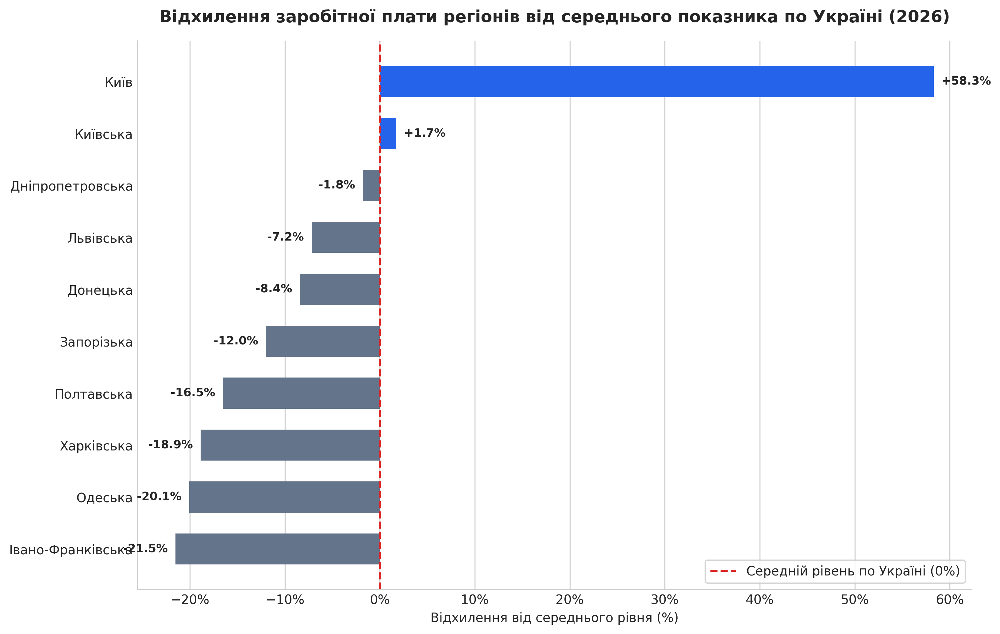
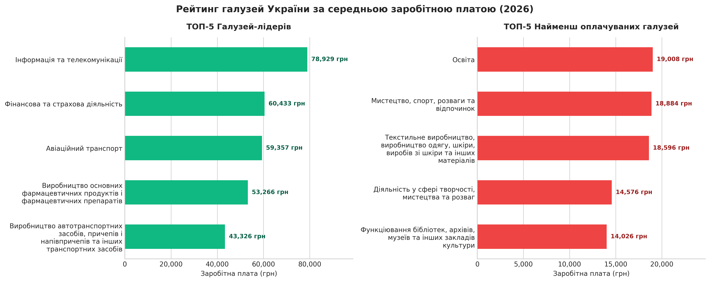
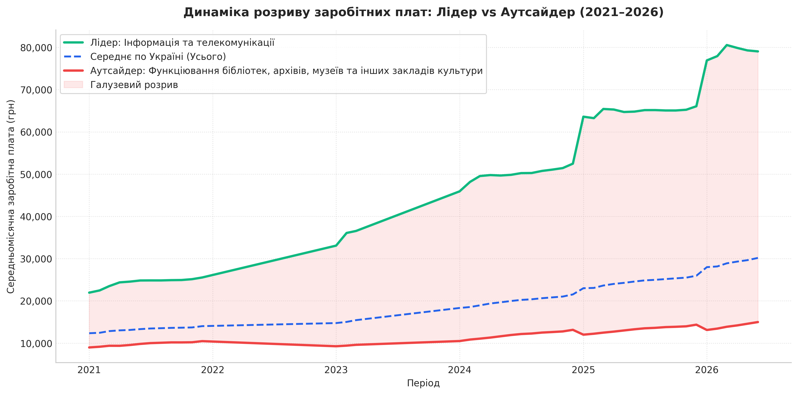

# Дослідження структури та динаміки заробітних плат в Україні (2021–2026)

## Джерело та параметри даних
Аналітичний звіт побудовано на офіційних даних Державної служби статистики України ([Банк даних stat.gov.ua](https://stat.gov.ua/uk/explorer)).

* **Шлях у системі:** Ринок праці → Обстеження підприємств із питань статистики праці (помісячна) → Середньомісячна заробітна плата штатних працівників.
* **Територіальне охоплення:** Україна (загальний бенчмарк), м. Київ, Київська, Дніпропетровська, Львівська, Донецька, Запорізька, Полтавська, Харківська, Одеська, Івано-Франківська області.
* **Галузеве охоплення:** Секції та підвиди КВЕД (IT, фінансова діяльність, транспорт, виробництво, освіта, охорона здоров'я, культура тощо).
* **Категорія:** Стать (Усього).
* **Часовий діапазон:** Помісячні спостереження за період з 2021-M01 по 2026-M06.

---

## 1. Географічний розріз: Столична концентрація доходів та регіональний дисбаланс

Розподіл оплати праці демонструє гостру територіальну поляризацію. Середньомісячна заробітна плата в м. Київ сягає **45 935,67 грн**, що на **+58.3%** перевищує загальнонаціональний рівень. Столиця фактично формує власний ізольований ринок праці, де рівень компенсацій у **2,02 раза** перевершує показники найменш оплачуваного регіону у вибірці — Івано-Франківської області (-21.5%).

Ключовим фактором такого відриву є так званий «ефект штаб-квартир»: концентрація центрів прийняття рішень, міжнародних корпорацій, фінансових інститутів та експортно-орієнтованих технологічних компаній у Києві забезпечує високу питому вагу високооплачуваного менеджменту. 

У свою чергу, більшість областей орієнтовані на аграрний сектор, переробну промисловість та бюджетну сферу з нижчою маржинальністю. Через значний масштаб столичної економіки показник Києва суттєво зміщує середньоарифметичний бенчмарк країни вгору, внаслідок чого навіть потужні індустріальні та ділові центри (Дніпропетровська обл. з -1.8% та Львівська обл. з -7.2%) формально опиняються нижче середньоукраїнської норми.

---

## 2. Галузевий зріз: Поляризація доданої вартості на ринку праці

Галузевий розподіл виявляє структурну нерівність між секторами економіки. Найвищий рівень винагороди зосереджений у високотехнологічних та капіталомістких сферах: «Інформація та телекомунікації» (**78 929 грн**), «Фінансова та страхова діяльність» (**60 433 грн**) та «Авіаційний транспорт» (**59 357 грн**). На протилежному полюсі перебувають базові соціальні та гуманітарні напрями: «Функціонування бібліотек, архівів, музеїв» (**14 026 грн**), «Творчість і мистецтво» (**14 576 грн**) та «Освіта» (**19 008 грн**).

Розрив між верхнім та нижнім квінтилями сягає **5.6 раза**. Ця диференціація зумовлена різницею в бізнес-моделях та джерелах фінансування:
* **Лідери ринку** генерують виручку у вільному ринковому середовищі, нерідко інтегровані у глобальні ланцюжки доданої вартості та захищені від валютних коливань прив'язкою контрактів до твердої валюти.
* **Аутсайдери рейтингу** здебільшого фінансуються з державного та місцевих бюджетів і прив'язані до жорсткої єдиної тарифної сітки, яка не встигає за ринковими темпами зростання вартості праці.

---

## 3. Часова динаміка: Розширення галузевої прірви (2021–2026)

Аналіз помісячних рядів за останні 5 років свідчить про довгострокове поглиблення соціально-економічного розшарування. Якщо на початку 2021 року співвідношення оплати праці в технологічному секторі до гуманітарного складало **~3.2–3.5 раза**, то до середини 2026 року розрив масштабувався до **5.6 раза**.

Така динаміка пояснюється асиметричною реакцією галузей на інфляційні шоки та кризові періоди. Комерційні та технологічні компанії оперативно переглядали бюджети винагород задля утримання ключових спеціалістів, тоді як у бюджетному секторі темпи індексації залишалися стриманими. 

У результаті високий коефіцієнт варіації заробітних плат (**48.41%**) підтверджує, що загальне зростання середніх показників по країні відбувається переважно за рахунок вузького пулу лідерів, тоді як реальна купівельна спроможність працівників бюджетних секторів зазнає тривалого тиску.

---

## Практичні рекомендації

### Для пошукачів та спеціалістів
* **Використання моделі територіального арбітражу:** Спеціалістам із регіонів із низьким рівнем компенсацій (Одеська, Івано-Франківська, Харківська області) доцільно орієнтуватися на віддалену зайнятість у компаніях столичного регіону. Це дозволяє нівелювати територіальний розрив у 20–58%, зберігаючи нижчий рівень побутових витрат.
* **Диверсифікація доходів у бюджетній сфері:** Працівникам освіти та культури критично важливо розвивати додаткові комерційні навички (EdTech, приватна практика, монетизація авторського контенту, проектна діяльність), оскільки базова державна сітка не забезпечує ринкового рівня компенсації.

### Для бізнесу та HR-менеджменту
* **Диференційоване регіональне грейдування:** Відмова від єдиної тарифної сітки для всіх підрозділів на користь локальних коефіцієнтів. Встановлення зарплат у регіональних представництвах на 10–15% нижче від київського бенчмарку зберігає лідерство компанії на локальному ринку праці та оптимізує фонд оплати праці.
* **Релокація операційних функцій:** Перенесення підтримуючих департаментів (бек-офіс, клієнтський сервіс, логістичні центри) зі столиці у Львівську чи Дніпропетровську області забезпечує доступ до кваліфікованого персоналу при суттєвій економії операційних витрат.

### Для освітніх центрів та організацій розвитку
* **Пріоритезація програм перекваліфікації (Reskilling):** Фокусування навчальних програм на фахівцях із хронічно низькооплачуваних напрямів (легка промисловість, культура, початкова освіта) для їх інтеграції в суміжні ролі в IT, логістиці, фармацевтиці та виробництві транспорту.

### Для державних органів
* **Модернізація системи оплати праці в бюджетній сфері:** Перегляд тарифних коефіцієнтів та впровадження гнучких KPI для освітян, медиків та працівників закладів культури задля запобігання критичному відтоку кадрів.
* **Фіскальні стимули для регіонального розвитку:** Створення умов для відкриття технологічних та виробничих кластерів за межами Києва з метою вирівнювання міжрегіональних економічних диспропорцій.

---

*Технічна документація щодо етапів очищення даних, структури пайплайну та формул розрахунку доступна у файлі [technical_report.md](technical_report.md).*